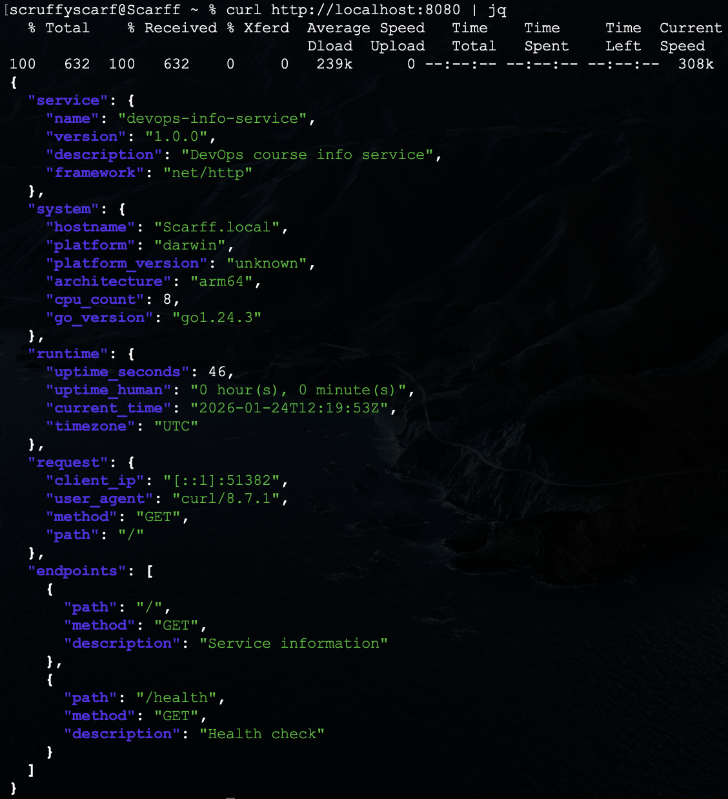
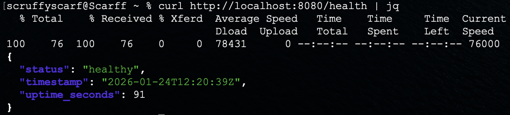
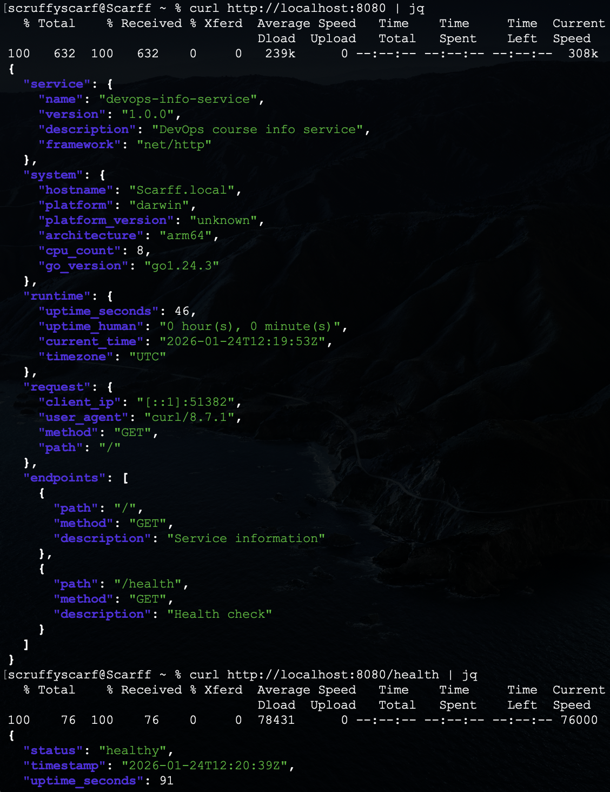

# Lab01 - DevOps Info Service: Web Application Development


## 1. Language Selection - **Go**

### Why Flask:
- Small binaries
- Fast compilation
- Everywhere in use

### Comparison Table with Alternatives:
| Language | Description |
|----------|-------------|
| Go | Small binaries, fast compilation, everywhere in use |
| Rust | Memory safety, modern features |
| Java/Spring Boot  | Enterprise standard |
| C#/ASP.NET Core  | Cross-platform .NET |


## 2. Best Practices Applied

### Clean Code Organization:
```bash
package main

import (
	"encoding/json"
	"net/http"
	"os"
	"runtime"
	"time"
	"fmt"
)

// Structs
type Service struct {
	Name        string `json:"name"`
	Version     string `json:"version"`
	Description string `json:"description"`
	Framework   string `json:"framework"`
}
```
Need for understanding the code more fast and meet the standards.

### Git Ignore (.gitignore):
```bash
# Python
__pycache__/
*.py[cod]
venv/
*.log

# IDE
.vscode/
.idea/

# OS
.DS_Store
```
Need for keep the large or important files and prevent them from being sent.


## 3. API Documentation

### Request (Main Endpoint):
```bash
curl http://localhost:5000 | jq
```

### Response :
```bash
{
  "service": {
    "name": "devops-info-service",
    "version": "1.0.0",
    "description": "DevOps course info service",
    "framework": "net/http"
  },
  "system": {
    "hostname": "Scarff.local",
    "platform": "darwin",
    "platform_version": "unknown",
    "architecture": "arm64",
    "cpu_count": 8,
    "go_version": "go1.24.3"
  },
  "runtime": {
    "uptime_seconds": 46,
    "uptime_human": "0 hour(s), 0 minute(s)",
    "current_time": "2026-01-24T12:19:53Z",
    "timezone": "UTC"
  },
  "request": {
    "client_ip": "[::1]:51382",
    "user_agent": "curl/8.7.1",
    "method": "GET",
    "path": "/"
  },
  "endpoints": [
    {
      "path": "/",
      "method": "GET",
      "description": "Service information"
    },
    {
      "path": "/health",
      "method": "GET",
      "description": "Health check"
    }
  ]
}
```

### Request (Health Check):
```bash
curl http://localhost:5000/health | jq
```

### Response :
```bash
{
  "status": "healthy",
  "timestamp": "2026-01-24T12:20:39Z",
  "uptime_seconds": 91
}
```


## 4. Testing Evidence

### Main Endpoint:


### Health Check:


### Formatted Output:



## 5. GitHub Community

### Why Stars Matter

**Discovery & Bookmarking:**
- Stars help you bookmark interesting projects for later reference
- Star count indicates project popularity and community trust
- Starred repos appear in your GitHub profile, showing your interests

**Open Source Signal:**
- Stars encourage maintainers (shows appreciation)
- High star count attracts more contributors
- Helps projects gain visibility in GitHub search and recommendations

**Professional Context:**
- Shows you follow best practices and quality projects
- Indicates awareness of industry tools and trends


### Why Following Matters

**Networking:**
- See what other developers are working on
- Discover new projects through their activity
- Build professional connections beyond the classroom

**Learning:**
- Learn from others' code and commits
- See how experienced developers solve problems
- Get inspiration for your own projects

**Collaboration:**
- Stay updated on classmates' work
- Easier to find team members for future projects
- Build a supportive learning community

**Career Growth:**
- Follow thought leaders in your technology stack
- See trending projects in real-time
- Build visibility in the developer community

**GitHub Best Practices:**
- Star repos you find useful (not spam)
- Follow developers whose work interests you
- Engage meaningfully with the community
- Your GitHub activity shows employers your interests and involvement