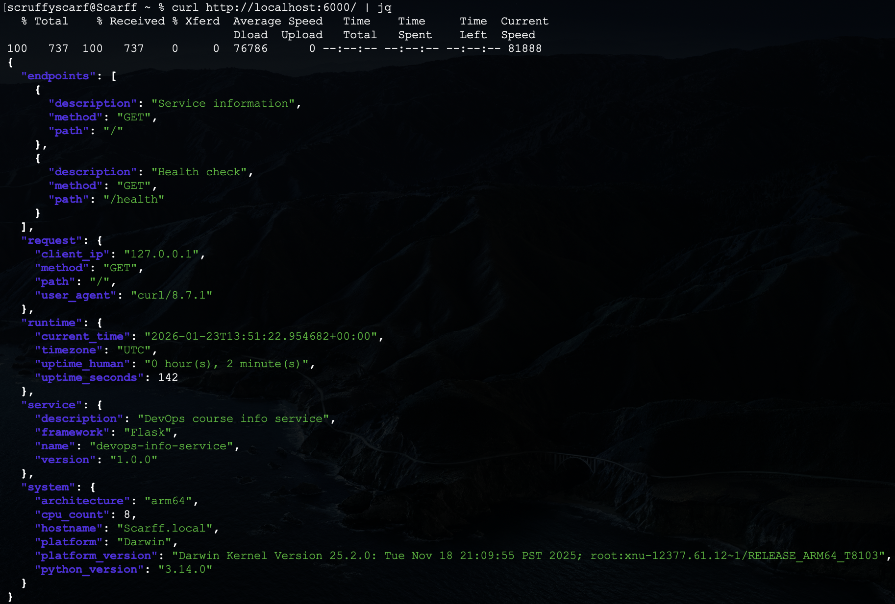
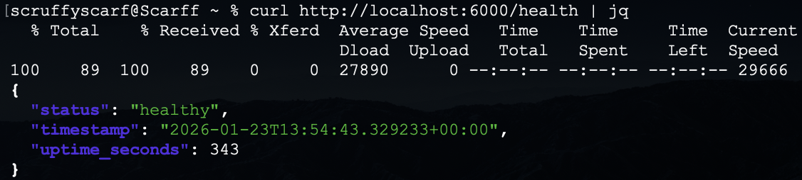
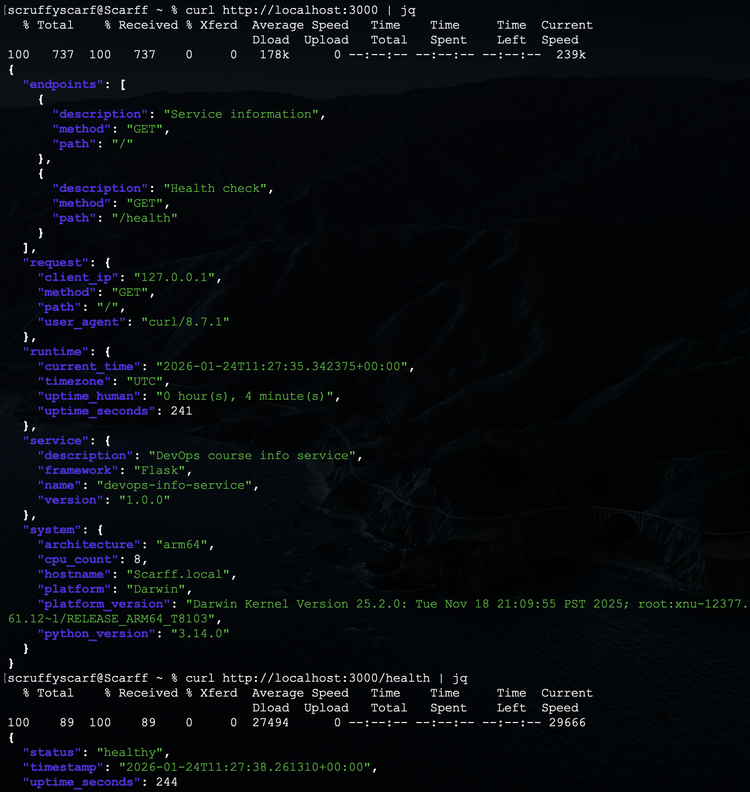

# Lab01 - DevOps Info Service: Web Application Development


## 1. Framework Selection - **Flask**

### Why Flask:
- Lightweight
- Easy to learn
- Everywhere in use

### Comparison Table with Alternatives:
| Framework | Description |
|---------|-------------|
| Flask | Lightweight, easy to learn |
| FastAPI | Modern, async, auto-documentation |
| Django | Full-featured, includes ORM |


## 2. Best Practices Applied

### Clean Code Organization:
```bash
"""
DevOps Info Service
Main application module
"""
import os
import platform
import socket
import time
import logging
from datetime import datetime, timezone
from flask import Flask, jsonify, request

# Configuration
HOST = os.getenv("HOST", "0.0.0.0")
PORT = int(os.getenv("PORT", 5000))
DEBUG = os.getenv("DEBUG", "False").lower() == "true"

# Application start time
app = Flask(__name__)
start_time = time.time()
```
Need for understanding the code more fast and meet the standards.

### Logging:
```bash
# Logging
logging.basicConfig(
    level=logging.INFO,
    format="%(asctime)s [%(levelname)s] %(message)s"
)
```
Need for understand how the code will behave.

### Dependencies (requirements.txt):
```bash
Flask==3.1.0
```
Need for correct execution of the code.


## 3. API Documentation

### Request (Main Endpoint):
```bash
curl http://localhost:5000 | jq
```

### Response :
```bash
{
  "endpoints": [
    {
      "description": "Service information",
      "method": "GET",
      "path": "/"
    },
    {
      "description": "Health check",
      "method": "GET",
      "path": "/health"
    }
  ],
  "request": {
    "client_ip": "127.0.0.1",
    "method": "GET",
    "path": "/",
    "user_agent": "curl/8.7.1"
  },
  "runtime": {
    "current_time": "2026-01-24T12:53:03.550450+00:00",
    "timezone": "UTC",
    "uptime_human": "0 hour(s), 0 minute(s)",
    "uptime_seconds": 11
  },
  "service": {
    "description": "DevOps course info service",
    "framework": "Flask",
    "name": "devops-info-service",
    "version": "1.0.0"
  },
  "system": {
    "architecture": "arm64",
    "cpu_count": 8,
    "hostname": "Scarff.local",
    "platform": "Darwin",
    "platform_version": "Darwin Kernel Version 25.2.0: Tue Nov 18 21:09:55 PST 2025; root:xnu-12377.61.12~1/RELEASE_ARM64_T8103",
    "python_version": "3.14.0"
  }
}
```

### Request (Health Check):
```bash
curl http://localhost:5000/health | jq
```

### Response :
```bash
{
  "status": "healthy",
  "timestamp": "2026-01-24T12:53:13.304962+00:00",
  "uptime_seconds": 20
}
```


## 4. Testing Evidence

### Main Endpoint:


### Health Check:


### Formatted Output:



## 5. GitHub Community

### Why Stars Matter

**Discovery & Bookmarking:**
- Stars help you bookmark interesting projects for later reference
- Star count indicates project popularity and community trust
- Starred repos appear in your GitHub profile, showing your interests

**Open Source Signal:**
- Stars encourage maintainers (shows appreciation)
- High star count attracts more contributors
- Helps projects gain visibility in GitHub search and recommendations

**Professional Context:**
- Shows you follow best practices and quality projects
- Indicates awareness of industry tools and trends


### Why Following Matters

**Networking:**
- See what other developers are working on
- Discover new projects through their activity
- Build professional connections beyond the classroom

**Learning:**
- Learn from others' code and commits
- See how experienced developers solve problems
- Get inspiration for your own projects

**Collaboration:**
- Stay updated on classmates' work
- Easier to find team members for future projects
- Build a supportive learning community

**Career Growth:**
- Follow thought leaders in your technology stack
- See trending projects in real-time
- Build visibility in the developer community

**GitHub Best Practices:**
- Star repos you find useful (not spam)
- Follow developers whose work interests you
- Engage meaningfully with the community
- Your GitHub activity shows employers your interests and involvement