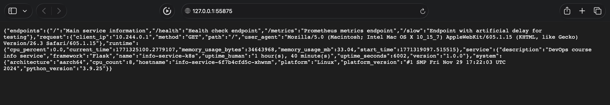

# Lab 9 — Kubernetes Fundamentals


## Local Kubernetes Setup

### Cluster setup

```bash
minikube start --driver=docker --cpus=2 --memory=2048 
```

```bash
😄  minikube v1.38.0 on Darwin 26.3 (arm64)
🆕  Kubernetes 1.35.0 is now available. If you would like to upgrade, specify: --kubernetes-version=v1.35.0
✨  Using the docker driver based on existing profile
❗  You cannot change the memory size for an existing minikube cluster. Please first delete the cluster.
❗  You cannot change the CPUs for an existing minikube cluster. Please first delete the cluster.
👍  Starting "minikube" primary control-plane node in "minikube" cluster
🚜  Pulling base image v0.0.49 ...
🤷  docker "minikube" container is missing, will recreate.
🔥  Creating docker container (CPUs=4, Memory=3000MB) ...
❗  Image was not built for the current minikube version. To resolve this you can delete and recreate your minikube cluster using the latest images. Expected minikube version: v1.37.0 -> Actual minikube version: v1.38.0
🐳  Preparing Kubernetes v1.34.0 on Docker 28.4.0 ...
🔗  Configuring bridge CNI (Container Networking Interface) ...
🔎  Verifying Kubernetes components...
💡  After the addon is enabled, please run "minikube tunnel" and your ingress resources would be available at "127.0.0.1"
    ▪ Using image gcr.io/k8s-minikube/storage-provisioner:v5
    ▪ Using image registry.k8s.io/metrics-server/metrics-server:v0.8.0
    ▪ Using image registry.k8s.io/ingress-nginx/controller:v1.14.1
    ▪ Using image registry.k8s.io/ingress-nginx/kube-webhook-certgen:v1.6.5
    ▪ Using image registry.k8s.io/ingress-nginx/kube-webhook-certgen:v1.6.5
🔎  Verifying ingress addon...
🌟  Enabled addons: storage-provisioner, metrics-server, default-storageclass, ingress
🏄  Done! kubectl is now configured to use "minikube" cluster and "default" namespace by default
```

### `kubectl cluster-info`

```bash
Kubernetes control plane is running at https://127.0.0.1:54553
CoreDNS is running at https://127.0.0.1:54553/api/v1/namespaces/kube-system/services/kube-dns:dns/proxy

To further debug and diagnose cluster problems, use 'kubectl cluster-info dump'.
```

### `kubectl get nodes`

```bash
kubectl get nodes
NAME       STATUS   ROLES           AGE     VERSION
minikube   Ready    control-plane   8m12s   v1.34.0
```

### `minikube` vs. `kind`

`minikube` - the most powerful tool for local development with Kubernetes. It creates a full-fledged single-node cluster, as close as possible to the production environment, and is perfectly supported on macOS via the Docker driver without the need for a separate VM.


## Architecture Overview

### Deployment Architecture

```bash
┌──────────────────────────────────────────────────────────────┐
│                     Kubernetes Cluster                       │
│                         (Minikube)                           │
│                                                              │
│  ┌──────────────────────────────────────────────────────┐    │
│  │                 Node (minikube)                      │    │
│  │                                                      │    │
│  │  ┌──────────────┐  ┌──────────────┐                  │    │
│  │  │ Pod: info-   │  │ Pod: info-   │                  │    │
│  │  │  service-1   │  │  service-2   │  ... (5 total)   │    │
│  │  │  ┌──────────┐│  │  ┌──────────┐│                  │    │
│  │  │  │Container:││  │  │Container:││                  │    │
│  │  │  │  Python  ││  │  │  Python  ││                  │    │
│  │  │  │   App    ││  │  │   App    ││                  │    │
│  │  │  │  :5050   ││  │  │  :5050   ││                  │    │
│  │  │  └──────────┘│  │  └──────────┘│                  │    │
│  │  └──────────────┘  └──────────────┘                  │    │
│  │         ▲                 ▲                          │    │
│  │         └────────┬────────┘                          │    │
│  │                  │                                   │    │
│  │  ┌───────────────┴───────────────┐                   │    │
│  │  │     Service: info-service     │                   │    │
│  │  │        Type: NodePort         │                   │    │
│  │  │       Port: 80 -> 5050        │                   │    │
│  │  │       NodePort: 30080         │                   │    │
│  │  └───────────────┬───────────────┘                   │    │
│  │                  │                                   │    │
│  └──────────────────┼───────────────────────────────────┘    │
│                     │                                        │
└─────────────────────┼────────────────────────────────────────┘
                      │
                 ┌────┴────┐
                 │ External│
                 │  User   │
                 └─────────┘
```

### Component Breakdown

| Component | Type | Count | Purpose |
|-----------|------|-------|---------|
| **Pods** | Python Application | 5 (scalable) | Run the actual application containers |
| **Deployment** | info-service | 1 | Manage Pod lifecycle, scaling, and updates |
| **Service** | info-service (NodePort) | 1 | Load balancing and service discovery |
| **Endpoints** | Internal | 5 | Track healthy Pods for traffic routing |

### Network Flow

1. **External Access**: `http://<node-ip>:30080` -> NodePort service
2. **Service Load Balancing**: service distributes traffic to healthy pods
3. **Pod Communication**: each pod handles requests on port 5050
4. **Health Checks**: kubernetes continuously monitors `/health` endpoint

### Resource Allocation Strategy

```yaml
Resource Strategy:
  Requests (guaranteed minimum):
    - Memory: 64Mi per Pod
    - CPU: 50m (0.05 core)
  Limits (maximum allowed):
    - Memory: 128Mi per Pod  
    - CPU: 100m (0.1 core)
  
Total Cluster Resources:
  Requests Total (5 Pods):
    - Memory: 320Mi
    - CPU: 250m
  Limits Total (5 Pods):
    - Memory: 640Mi
    - CPU: 500m
```


## Manifest Files

- `deployment.yml` - main application deployment:

    - **3 replicas**: minimum for high availability
    - **maxUnavailable: 0**: zero-downtime deployments guaranteed
    - **Resource limits**: prevent noisy neighbor problems, match application profiling
    - **User 1000**: matches Dockerfile's appuser, security best practice

- `service.yml` - service exposure:

    - Perfect for local development
    - No cloud provider dependencies
    - Fixed port for consistent testing


## Deployment Evidence

### `kubectl get all`

```bash
kubectl get all
NAME                                READY   STATUS    RESTARTS   AGE
pod/info-service-6f7b4cfd5c-bx7w6   1/1     Running   0          76m
pod/info-service-6f7b4cfd5c-djrj5   1/1     Running   0          90m
pod/info-service-6f7b4cfd5c-k6rq9   1/1     Running   0          76m
pod/info-service-6f7b4cfd5c-t8m8f   1/1     Running   0          90m
pod/info-service-6f7b4cfd5c-xhwnm   1/1     Running   0          90m

NAME                   TYPE        CLUSTER-IP      EXTERNAL-IP   PORT(S)        AGE
service/info-service   NodePort    10.101.203.17   <none>        80:30080/TCP   86m
service/kubernetes     ClusterIP   10.96.0.1       <none>        443/TCP        120m

NAME                           READY   UP-TO-DATE   AVAILABLE   AGE
deployment.apps/info-service   5/5     5            5           90m

NAME                                      DESIRED   CURRENT   READY   AGE
replicaset.apps/info-service-5bf68fbd86   0         0         0       75m
replicaset.apps/info-service-6f7b4cfd5c   5         5         5       90m
```

### `kubectl get pods,svc`

```bash
kubectl get pods,svc
NAME                                READY   STATUS    RESTARTS   AGE
pod/info-service-6f7b4cfd5c-bx7w6   1/1     Running   0          77m
pod/info-service-6f7b4cfd5c-djrj5   1/1     Running   0          91m
pod/info-service-6f7b4cfd5c-k6rq9   1/1     Running   0          77m
pod/info-service-6f7b4cfd5c-t8m8f   1/1     Running   0          91m
pod/info-service-6f7b4cfd5c-xhwnm   1/1     Running   0          91m

NAME                   TYPE        CLUSTER-IP      EXTERNAL-IP   PORT(S)        AGE
service/info-service   NodePort    10.101.203.17   <none>        80:30080/TCP   86m
service/kubernetes     ClusterIP   10.96.0.1       <none>        443/TCP        121m
```

### `kubectl describe deployment info-service`

```bash
Name:                   info-service
Namespace:              default
CreationTimestamp:      Tue, 17 Feb 2026 12:04:35 +0300
Labels:                 app=info-service
                        environment=development
                        tier=backend
Annotations:            deployment.kubernetes.io/revision: 3
Selector:               app=info-service
Replicas:               5 desired | 5 updated | 5 total | 5 available | 0 unavailable
StrategyType:           RollingUpdate
MinReadySeconds:        0
RollingUpdateStrategy:  0 max unavailable, 1 max surge
Pod Template:
  Labels:  app=info-service
           tier=backend
           version=v1
  Containers:
   info-service:
    Image:      scruffyscarf/info-service-python:latest
    Port:       5050/TCP (http)
    Host Port:  0/TCP (http)
    Limits:
      cpu:     100m
      memory:  128Mi
    Requests:
      cpu:      50m
      memory:   64Mi
    Liveness:   http-get http://:5050/health delay=15s timeout=3s period=10s #success=1 #failure=3
    Readiness:  http-get http://:5050/health delay=5s timeout=2s period=5s #success=1 #failure=3
    Environment:
      APP_NAME:    info-service-k8s
      DEBUG:       false
    Mounts:        <none>
  Volumes:         <none>
  Node-Selectors:  <none>
  Tolerations:     <none>
Conditions:
  Type           Status  Reason
  ----           ------  ------
  Available      True    MinimumReplicasAvailable
  Progressing    True    NewReplicaSetAvailable
OldReplicaSets:  info-service-5bf68fbd86 (0/0 replicas created)
NewReplicaSet:   info-service-6f7b4cfd5c (5/5 replicas created)
Events:          <none>
```

### `minikube service info-service`




## Operations Performed

### Deployment

- `kubectl apply -f k8s/deployment.yml`
- `kubectl apply -f k8s/service.yml`

### Scaling

- Scaling Operations:

```bash
NAME                            READY   STATUS    RESTARTS   AGE
info-service-6f7b4cfd5c-bx7w6   1/1     Running   0          108m
info-service-6f7b4cfd5c-djrj5   1/1     Running   0          122m
info-service-6f7b4cfd5c-k6rq9   1/1     Running   0          108m
info-service-6f7b4cfd5c-t8m8f   1/1     Running   0          122m
info-service-6f7b4cfd5c-xhwnm   1/1     Running   0          122m
```

### Rolling update

```bash
kubectl set image deployment/info-service info-service=scruffyscarf/info-service-python:v2
```

```bash
deployment.apps/info-service image updated
```

### Service access verification:

- `minikube service info-service --url`
- `kubectl port-forward service/info-service 8080:80`


## Production considerations

### Health checks implementation

```yaml
Liveness Probe:
  - HTTP GET /health on port 5050
  - initialDelaySeconds: 15  # Give app time to start
  - periodSeconds: 10        # Check every 10 seconds
  - failureThreshold: 3      # Restart after 3 failures
  
Readiness Probe:
  - HTTP GET /health on port 5050
  - initialDelaySeconds: 5   # Quick initial check
  - periodSeconds: 5         # Frequent checks
  - successThreshold: 1      # Ready after 1 success
```

- **Liveness**: Restarts unresponsive containers
- **Readiness**: Only sends traffic to healthy Pods
- **/health endpoint**: Your app already implements this perfectly

### Resource limits rationale

| Resource | Request | Limit | Justification |
|----------|---------|-------|---------------|
| Memory   | 64Mi    | 128Mi | App uses ~40MB at rest, 128MB limit allows for spikes |
| CPU      | 50m     | 100m  | Lightweight Python app, 100m sufficient for normal load |

### Production improvements

- High Availability

  - Deploy across multiple availability zones
  - Use PodDisruptionBudget for voluntary disruptions
  - Implement Horizontal Pod Autoscaling based on CPU/Memory

- Configuration Management

  - Use ConfigMaps for environment-specific configs
  - Store secrets in External Secrets Operator or HashiCorp Vault
  - Implement Helm charts for versioned releases

### Monitoring and observability strategy

- Logging:

  - Structured JSON logging from application
  - Fluentd/FluentBit for log aggregation
  - Elasticsearch for storage and Kibana for visualization

- Dashboards:

  - Request rate and latency
  - Error rates by endpoint
  - Resource utilization
  - Pod status and scaling events

**Kubernetes** automates container orchestration through declarative configuration — desired state in YAML files, and the control plane continuously reconciles actual state with desired state using controllers and reconciliation loops. Deployments manage application lifecycle and rolling updates, Services provide stable networking and load balancing to ephemeral Pods, and probes enable self-healing through automatic health checking. Most importantly, Kubernetes is a declarative system — the platform handles scheduling, scaling, and healing automatically.


## Ingress with TLS

### Deployed applications 

```bash
curl -k https://local.example.com/app1
```

```bash
{"endpoints":{"/":"Main service information","/health":"Health check endpoint","/metrics":"Prometheus metrics endpoint","/slow":"Endpoint with artificial delay for testing"},"request":{"client_ip":"10.244.0.29","method":"GET","path":"/","user_agent":"curl/8.7.1"},"runtime":{"cpu_percent":0.0,"current_time":1771353536.4107773,"memory_usage_bytes":32612352,"memory_usage_mb":31.1,"start_time":1771353245.1643987},"service":{"description":"DevOps course info service","framework":"Flask","name":"info-service-k8s","uptime_human":"0 hour(s), 4 minute(s)","uptime_seconds":291,"version":"1.0.0"},"system":{"architecture":"aarch64","cpu_count":8,"hostname":"info-service-6f7b4cfd5c-69xxs","platform":"Linux","platform_version":"#1 SMP Fri Nov 29 17:22:03 UTC 2024","python_version":"3.9.25"}}
```

```bash
curl -k https://local.example.com/app2    
```

```bash
Hello from Echo App (App2)
```

### Ingress manifest with routing rules

```bash
kubectl get ingress
```

```bash
NAME           CLASS   HOSTS               ADDRESS        PORTS     AGE
apps-ingress   nginx   local.example.com   192.168.49.2   80, 443   28m
```

```bash
kubectl describe ingress apps-ingress
```

```bash
Name:             apps-ingress
Labels:           <none>
Namespace:        default
Address:          192.168.49.2
Ingress Class:    nginx
Default backend:  <default>
TLS:
  tls-secret terminates local.example.com
Rules:
  Host               Path  Backends
  ----               ----  --------
  local.example.com  
                     /app1   info-service:80 (10.244.0.33:5050,10.244.0.34:5050,10.244.0.35:5050 + 2 more...)
                     /app2   echo-app-service:80 (10.244.0.38:8080,10.244.0.39:8080)
                     /       info-service:80 (10.244.0.33:5050,10.244.0.34:5050,10.244.0.35:5050 + 2 more...)
Annotations:         nginx.ingress.kubernetes.io/force-ssl-redirect: true
                     nginx.ingress.kubernetes.io/rewrite-target: /
                     nginx.ingress.kubernetes.io/ssl-redirect: true
Events:
  Type    Reason  Age                From                      Message
  ----    ------  ----               ----                      -------
  Normal  Sync    29m (x2 over 29m)  nginx-ingress-controller  Scheduled for sync
```

### TLS configuration and certificate

```bash
kubectl get secret tls-secret -o yaml
```

```bash
apiVersion: v1
data:
  tls.crt: LS0...
  tls.key: LS0...
kind: Secret
metadata:
  creationTimestamp: "2026-02-17T11:32:32Z"
  name: tls-secret
  namespace: default
  resourceVersion: "11331"
  uid: b67ec...
type: kubernetes.io/tls
```

### All resources

```bash
kubectl get all
```

```bash
NAME                                READY   STATUS    RESTARTS   AGE
pod/echo-app-75d8464bdb-7vk5j       1/1     Running   0          16m
pod/echo-app-75d8464bdb-jbnnt       1/1     Running   0          16m
pod/info-service-6f7b4cfd5c-5m88k   1/1     Running   0          16m
pod/info-service-6f7b4cfd5c-69xxs   1/1     Running   0          16m
pod/info-service-6f7b4cfd5c-cp899   1/1     Running   0          16m
pod/info-service-6f7b4cfd5c-g95vq   1/1     Running   0          16m
pod/info-service-6f7b4cfd5c-qf758   1/1     Running   0          16m

NAME                       TYPE        CLUSTER-IP     EXTERNAL-IP   PORT(S)        AGE
service/echo-app-service   ClusterIP   10.100.218.7   <none>        80/TCP         16m
service/info-service       NodePort    10.108.95.88   <none>        80:30080/TCP   16m
service/kubernetes         ClusterIP   10.96.0.1      <none>        443/TCP        17m

NAME                           READY   UP-TO-DATE   AVAILABLE   AGE
deployment.apps/echo-app       2/2     2            2           16m
deployment.apps/info-service   5/5     5            5           16m

NAME                                      DESIRED   CURRENT   READY   AGE
replicaset.apps/echo-app-75d8464bdb       2         2         2       16m
replicaset.apps/info-service-6f7b4cfd5c   5         5         5       16m
```

### Explanation of Ingress benefits over NodePort Services

| Aspect | NodePort | Ingress |
| --- | --- | --- |
| **Ports** | One port per service (30000-32767) | One port (80/443) for all services |
| **Routing** | By IP and port only | By domains and paths (L7) |
| **TLS** | Configured separately on each service | Centralized TLS termination |
| **Scaling** | Individual | Single entry point |
| **Client Complexity** | Client must know the specific port | Only domain names are needed |
