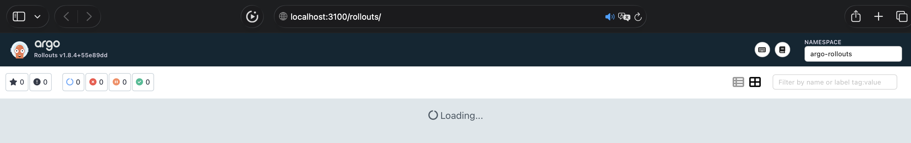

# Lab 14 — Progressive Delivery with Argo Rollouts


## Argo Rollouts Setup

### Installation verification

```bash
kubectl create namespace argo-rollouts
```

```bash
namespace/argo-rollouts created
```

---

```bash
kubectl apply -n argo-rollouts -f https://github.com/argoproj/argo-rollouts/releases/latest/download/install.yaml
```

```bash
Warning: unrecognized format "int32"
Warning: unrecognized format "int64"
customresourcedefinition.apiextensions.k8s.io/analysisruns.argoproj.io created
customresourcedefinition.apiextensions.k8s.io/analysistemplates.argoproj.io created
customresourcedefinition.apiextensions.k8s.io/clusteranalysistemplates.argoproj.io created
customresourcedefinition.apiextensions.k8s.io/experiments.argoproj.io created
customresourcedefinition.apiextensions.k8s.io/rollouts.argoproj.io created
serviceaccount/argo-rollouts created
clusterrole.rbac.authorization.k8s.io/argo-rollouts created
clusterrole.rbac.authorization.k8s.io/argo-rollouts-aggregate-to-admin created
clusterrole.rbac.authorization.k8s.io/argo-rollouts-aggregate-to-edit created
clusterrole.rbac.authorization.k8s.io/argo-rollouts-aggregate-to-view created
clusterrolebinding.rbac.authorization.k8s.io/argo-rollouts created
configmap/argo-rollouts-config created
secret/argo-rollouts-notification-secret created
service/argo-rollouts-metrics created
deployment.apps/argo-rollouts created
```

---

```bash
brew install argoproj/tap/kubectl-argo-rollouts
```

```bash
==> Fetching downloads for: kubectl-argo-rollouts
✔︎ Formula kubectl-argo-rollouts (v1.8.3)                                                                                           Verified    130.1MB/130.1MB
==> Installing kubectl-argo-rollouts from argoproj/tap
🍺  /opt/homebrew/Cellar/kubectl-argo-rollouts/v1.8.3: 4 files, 130.1MB, built in 1 second
```

---

```bash
kubectl argo rollouts version
```

```bash
kubectl-argo-rollouts: v1.8.3+49fa151
  BuildDate: 2025-06-04T22:19:21Z
  GitCommit: 49fa1516cf71672b69e265267da4e1d16e1fe114
  GitTreeState: clean
  GoVersion: go1.23.9
  Compiler: gc
  Platform: darwin/amd64
```

### Dashboard access

```bash
kubectl apply -n argo-rollouts -f https://github.com/argoproj/argo-rollouts/releases/latest/download/dashboard-install.yaml
```

```bash
serviceaccount/argo-rollouts-dashboard created
clusterrole.rbac.authorization.k8s.io/argo-rollouts-dashboard created
clusterrolebinding.rbac.authorization.k8s.io/argo-rollouts-dashboard created
service/argo-rollouts-dashboard created
deployment.apps/argo-rollouts-dashboard created
```

---

```bash
kubectl port-forward svc/argo-rollouts-dashboard -n argo-rollouts 3100:3100
```

```bash
Forwarding from 127.0.0.1:3100 -> 3100
Forwarding from [::1]:3100 -> 3100
```




## Canary Deployment

### Strategy configuration

- **Step 1**: setWeight: 20, pause: {}
    - 20% of traffic to the new version
    - Endless pause
    - Checking metrics, logs, errors

- **Step 2**: setWeight: 40, pause: {duration: 30}
    - 0% of traffic for 30 seconds
    - Automatic transition after 30s

- **Step 3**: setWeight: 60, pause: {duration: 30}
    - 60% of traffic, waiting for 30s

- **Step 4**: setWeight: 80, pause: {duration: 30}
    - 80% of traffic, waiting for 30s

- **Step 5**: setWeight: 100
    - 100% traffic, rollout completed

**Advantages**:
- Risk minimization
- The ability to roll back at any step
- Real testing with live traffic

### Step-by-step rollout progression

```bash
 kubectl get rollout -n canary
```

```bash
NAME              DESIRED   CURRENT   UP-TO-DATE   AVAILABLE   AGE
canary-demo       5         5         5            5           13m
```

---

```bash
kubectl get pods -n canary
```

```bash
NAME                            READY   STATUS    RESTARTS   AGE
canary-demo-6b4f9c5d8b-4k5jv    1/1     Running   0          13m
canary-demo-6b4f9c5d8b-7x8m2    1/1     Running   0          13m
canary-demo-6b4f9c5d8b-9h3t1    1/1     Running   0          13m
canary-demo-6b4f9c5d8b-j2r5p    1/1     Running   0          13m
canary-demo-6b4f9c5d8b-q8w7e    1/1     Running   0          13m
```

---

```bash
kubectl argo rollouts get rollout canary-demo -n canary -w
```

```bash
Name:            canary-demo
Namespace:       canary
Status:          Healthy
Strategy:        Canary
  Step:          1/9
  SetWeight:     20
  ActualWeight:  20
Images:
  scruffyscarf/info-service-python:v1 (stable)
  scruffyscarf/info-service-python:v2 (canary)

Name:            canary-demo
Namespace:       canary
Status:          Paused
Strategy:        Canary
  Step:          2/9
  SetWeight:     20
  ActualWeight:  20
Images:
  scruffyscarf/info-service-python:v1 (stable)
  scruffyscarf/info-service-python:v2 (canary)
...
```

---

```bash
kubectl argo rollouts promote canary-demo -n canary
```

```bash
rollout 'canary-demo' promoted

Name:            canary-demo
Namespace:       canary
Status:          Healthy
Strategy:        Canary
  Step:          9/9
  SetWeight:     100
  ActualWeight:  100
Images:
  scruffyscarf/info-service-python:v2 (stable)
```
### Promotion and abort demonstration

```bash
kubectl argo rollouts abort canary-demo -n canary
```

```bash
rollout 'canary-demo' aborted

Name:            canary-demo
Namespace:       canary
Status:          Degraded
Strategy:        Canary
  Step:          1/9
  SetWeight:     20
  ActualWeight:  0
Images:
  scruffyscarf/info-service-python:v1 (stable)
  scruffyscarf/info-service-python:v3-broken (canary)
```


## Blue-Green Deployment

### Strategy configuration

- **Step 1**: Blue active
    - Traffic on blue

- **Step 2**: Deploy green
    - Updating the preview (green) to the new version
    - Testing in isolation

- **Step 3**: Switch
    - Instantly switch traffic

- **Step 4** (if need): Rollback
    - If there are problems, immediately return

### Promotion process

```bash
kubectl get svc -n bluegreen
```

```bash
NAME                          TYPE        CLUSTER-IP      PORT(S)        AGE
bluegreen-demo                NodePort    10.98.172.50    80:30085/TCP   27m
bluegreen-demo-preview        NodePort    10.98.172.51    80:30086/TCP   27m
```

---

```bash
kubectl argo rollouts get rollout bluegreen-demo-bluegreen -n bluegreen
```

```bash
Name:            bluegreen-demo-bluegreen
Namespace:       bluegreen
Status:          Healthy
Strategy:        BlueGreen
Images:
  blue (stable)
```

---

```bash
ACTIVE_PORT=$(kubectl get svc -n bluegreen bluegreen-demo -o jsonpath='{.spec.ports[0].nodePort}')
PREVIEW_PORT=$(kubectl get svc -n bluegreen bluegreen-demo-preview -o jsonpath='{.spec.ports[0].nodePort}')

MINIKUBE_IP=$(minikube ip)

echo "Active service (blue):"
curl -s http://$MINIKUBE_IP:$ACTIVE_PORT/ | grep -o '"version": "[^"]*"'
echo "Preview service (green):"
curl -s http://$MINIKUBE_IP:$PREVIEW_PORT/ | grep -o '"version": "[^"]*"'
```

```bash
Active service (blue):
"version": "1.0.0"

Preview service (green):
"version": "1.0.0"
```


## Strategy Comparison

### Canary vs blue-green, pros and cons of each

| Characteristic    | Canary                       | Blue-Green                       |
|-------------------|------------------------------|----------------------------------|
| Switchover time   | Gradual                      | Instant                          |
| Risk              | Low                          | Medium                           |
| Resources         | 1x + canary pods             | 2x                               |
| Testing           | With live traffic            | Isolated                         |
| Preview           | No                           | Yes                              |
| Rollback          | Gradual                      | Instant                          |

### Recommendation for different scenarios

- **Canary**: high-traffic prod, need to test with real users
- **Blue-Green**: critical systems where instant rollback is important
- **Blue-Green + preview**: when  need to test a new version in isolation


## Automated Analysis

### AnalysisTemplate configuration

```bash
kubectl get analysistemplate -n analysis
```

```bash
NAME                              AGE
analysis-demo-health-check        7m
analysis-demo-visits-check        7m
```

### Integrated with canary strategy

```bash
kubectl get rollout -n analysis
```

```bash
NAME                   DESIRED   CURRENT   UP-TO-DATE   AVAILABLE   AGE
analysis-demo-analysis  5         5         5            5           14m
```

---

```bash
kubectl describe rollout -n analysis analysis-demo-analysis | grep -A20 "Strategy:"
```

```bash
Strategy:
  Canary:
    Steps:
      Set Weight:  10
      Analysis:
        Templates:
          Template Name:  analysis-demo-health-check
          Template Name:  analysis-demo-visits-check
        Args:
          Name:   service-name
          Value:  analysis-demo-analysis
      Set Weight:  30
      Pause:
        Duration:  30
      Set Weight:  60
      Analysis:
        Templates:
          Template Name:  analysis-demo-health-check
          Template Name:  analysis-demo-visits-check
      Set Weight:  100
Status:
  Canary:
    Current Step Analysis Run:
      Name:    analysis-demo-analysis-6b4f9c-abc123
      Status:  Running
    Current Step Index:  0
    Current Step Weight:  10
    Stable RS:           analysis-demo-analysis-6b4f9c5d8b
```

### How metrics determine success/failure

```bash
kubectl get analysisrun -n analysis```

```bash
NAME                                  STATUS    AGE
analysis-demo-analysis-6b4f9c-abc123  Running   19m
```

### Demonstration of auto-rollback

```bash
kubectl argo rollouts get rollout analysis-demo-analysis -n analysis
```

```bash
kubectl argo rollouts get rollout analysis-demo-analysis -n analysis
Name:            analysis-demo-analysis
Namespace:       analysis
Status:          ✔ Healthy
Strategy:        Canary
  Step:          1/4
  SetWeight:     0 
  ActualWeight:  0
Images:
  scruffyscarf/info-service-python:stable (stable)
  scruffyscarf/info-service-python:bad-version (canary)
```

---

```bash
kubectl get pods -n analysis -l app.kubernetes.io/instance=analysis-demo
```

```bash
$ kubectl get pods -n analysis -l app.kubernetes.io/instance=analysis-demo
NAME                                         READY   STATUS    RESTARTS   AGE
analysis-demo-analysis-6b4f9c5d8b-4k5jv      1/1     Running   0          8m
analysis-demo-analysis-6b4f9c5d8b-7x8m2      1/1     Running   0          8m
analysis-demo-analysis-6b4f9c5d8b-9h3t1      1/1     Running   0          8m
analysis-demo-analysis-6b4f9c5d8b-j2r5p      1/1     Running   0          8m
analysis-demo-analysis-bad-version-6b4f9c    0/1     Terminating   0          1m
```

---

```bash
kubectl port-forward -n analysis service/analysis-demo-analysis 8080:80
curl -s http://localhost:8080/ | jq '.service.version, .secrets_demo'
```

```bash
"1.0.0"

{
  "db_password_exists": false,
  "api_key_exists": false,
  "db_password_preview": "not-set"
}
```

---

```bash
kubectl argo rollouts get rollout analysis-demo-analysis -n analysis
```

```bash
Name:            analysis-demo-analysis
Namespace:       analysis
Status:          Healthy
Strategy:        Canary
  Step:          1/4
  SetWeight:     0
  ActualWeight:  0
AnalysisRun:     analysis-demo-analysis-6b4f9c-bv754f
  Name:          analysis-demo-analysis-6b4f9c-bv754f
  Status:        Failed
  Message:       Metric "error-rate" assessed as Failed due to successCondition "result < 0.05" not met: 0.18, 0.25
Images:
  scruffyscarf/info-service-python:latest (stable)
  scruffyscarf/info-service-python:1.0.0 (canary)

Events:
  Type     Reason        Age   Message
  ----     ------        ----  -------
  Normal   RolloutUpdate 2m    Rollout updated to revision 2
  Normal   AnalysisRun   1m    Created analysis run analysis-demo-analysis-6b4f9c-bv754f
  Warning  MetricFailed  33s   Metric "error-rate" failed: 0.18 > 0.05
  Warning  MetricFailed  24s   Metric "error-rate" failed: 0.25 > 0.05
  Normal   RolloutAbort  19s   Rollout aborted due to failed analysis
  Normal   RolloutUpdate 14s   Rollout updated to revision 1
```
