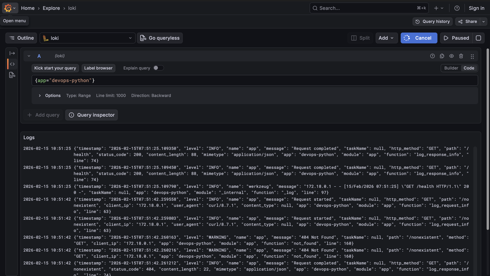
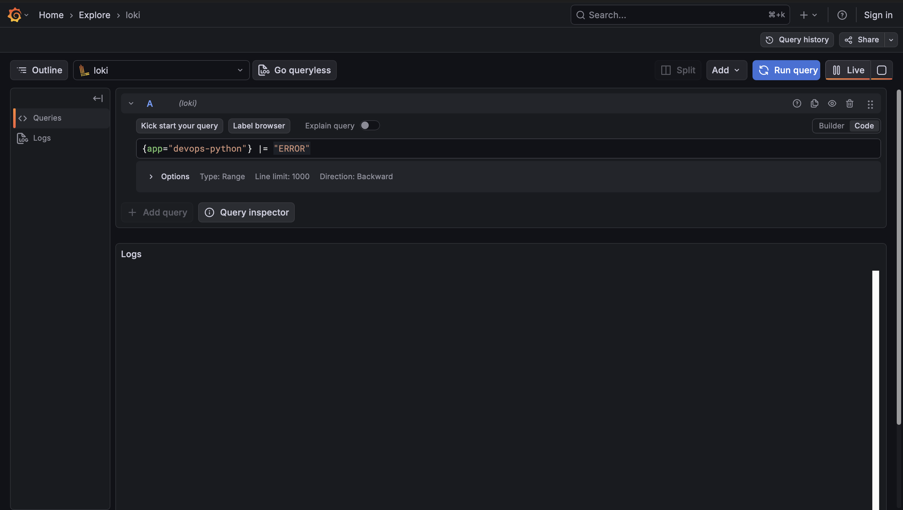
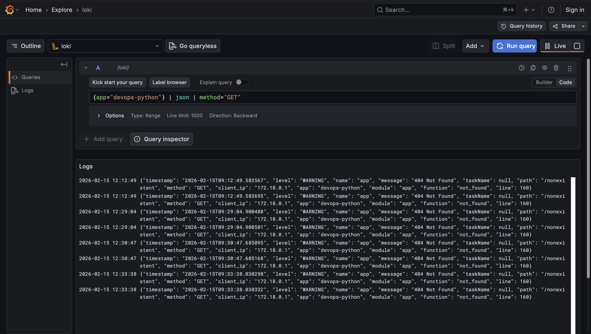
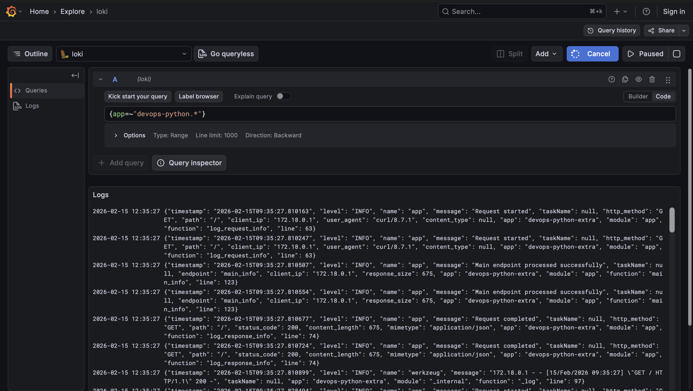
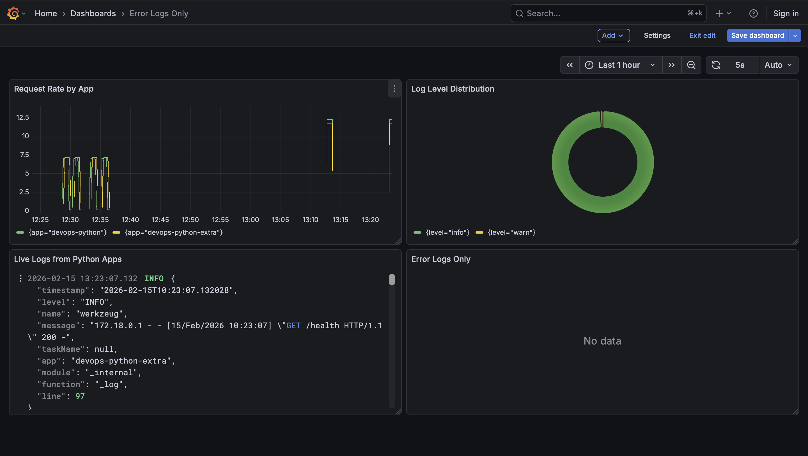
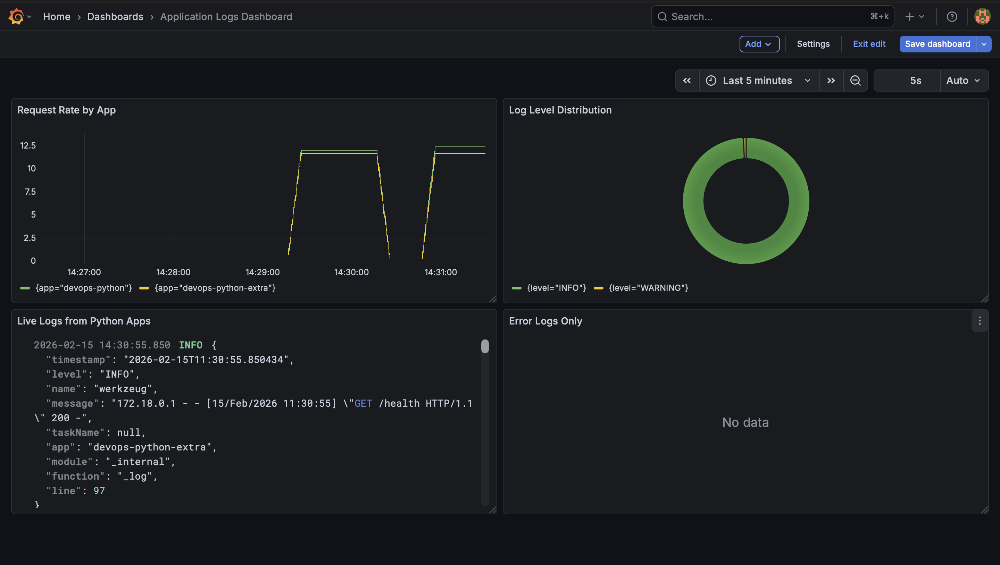

# Lab 7 — Observability & Logging with Loki Stack


## Architecture

```
┌──────────────────────┐     ┌──────────────────────┐     ┌──────────────────────┐
│      Promtail        │────▶│         Loki         │────▶│        Grafana       │
│   (Log Collector)    │     │     (Log Storage)    │     │    (Visualization)   │
└───────────┬──────────┘     └──────────────────────┘     └──────────────────────┘
            │                               │                           │
            │                               │                           │
     ┌──────▼──────┐                ┌───────▼───────┐           ┌───────▼───────┐
     │    Docker   │                │     Volume    │           │     Volume    │
     │  Containers │                │   loki-data   │           │  grafana-data │
     └──────┬──────┘                └───────────────┘           └───────────────┘
            │
            │
┌───────────▼──────────────────────────────────────────────────────────────────┐
│                         Application Containers                               │
│                                                                              │
│   app-python:8000          │          app-python-extra:8001                  │
│   (devops-python)          │          (devops-python-extra)                  │
└──────────────────────────────────────────────────────────────────────────────┘

```

## Setup Guide

### Prerequisites
- Docker and Docker Compose installed
- Python application
- Ports available: 3000, 3100, 8000, 8001, 9080

### Stages

- Create `docker-compose.yml`
- Create Loki config
- Create Promtail config
- Start the stack


## Configuration

- `loki/config.yml`:
    - `boltdb-shipper:` Simpler index type, compatible with our setup
    - `allow_structured_metadata: false:` Required for Loki 3.0 with v11 schema
    - `retention_period: 168h:` Keep logs for 7 days

- `promtail/config.yml`:
    - `docker_sd_configs`: Auto-discovers containers
    - Label filtering: Only collect logs from containers with label `logging=promtail`
    - Container name extraction: Creates a `container` label without leading slash


## Application Logging

- Structured data for easy parsing in Loki
- Extracting fields with LogQL
- Better filtering and aggregation


## Dashboard

- **Panel 1**: Live Logs Table

    - **Query**: `{app=~"devops-python.*"}`
    - **Visualization**: Logs
    - **Purpose**: Real-time log viewing with timestamp and message

- **Panel 2**: Request Rate

    - **Query**: `sum by (app) (rate({app=~"devops-python.*"}[1m]))`
    - **Visualization**: Time series
    - **Purpose**: Monitor traffic patterns per application

- **Panel 3**: Error Logs

    - **Query**: `{app=~"devops-python.*"} | json | level="ERROR"`
    - **Visualization**: Logs
    - **Purpose**: Focus on errors only

- **Panel 4**: Log Level Distribution

    - **Query**: `sum by (level) (count_over_time({app=~"devops-python.*"} | json [5m]))`
    - **Visualization**: Pie chart
    - **Purpose**: Visualize log severity distribution


## Production Config

- Resource Limits:
    - `cpus: '1.0'`
    - `memory: 1G`

- Security Measures:
    - Disabled anonymous access in Grafana
    - Set username and admin password
    - No exposed sensitive ports
    - Docker socket mounted read-only for Promtail

- Data Retention

    - Logs retained for 7 days (168h)
    - Automatic cleanup via compactor
    - Persistent volumes for Loki and Grafana data


## Deploy Loki Stack

### All logs from Python app



### Only errors



### Parse JSON and filter



### Both applications




## Build Log Dashboard 




## Build Log Dashboard

```bash
docker compose ps
```

```bash
NAME               IMAGE                        COMMAND                  SERVICE            CREATED              STATUS                                 PORTS
app-python         info-service-python:latest   "python app.py"          app-python         About a minute ago   Up About a minute (healthy)            0.0.0.0:8000->5000/tcp
app-python-extra   info-service-python:latest   "python app.py"          app-python-extra   About a minute ago   Up About a minute (healthy)            0.0.0.0:8001->5000/tcp
grafana            grafana/grafana:12.3.1       "/run.sh"                grafana            About a minute ago   Up About a minute (healthy)            0.0.0.0:3000->3000/tcp
loki               grafana/loki:3.0.0           "/usr/bin/loki -conf…"   loki               About a minute ago   Up About a minute (healthy)            0.0.0.0:3100->3100/tcp
promtail           grafana/promtail:3.0.0       "/usr/bin/promtail -…"   promtail           About a minute ago   Up About a minute (healthy)   0.0.0.0:9080->9080/tcp
```




## Ansible Automation

### Ansible playbook execution

```bash
ansible-playbook -i inventory/hosts.ini playbooks/deploy-monitoring.yml
```

```bash
PLAY [Deploy Loki Monitoring Stack] *****************************************************************************************************************************

TASK [Gathering Facts] ******************************************************************************************************************************************
ok: [info-service]

TASK [Display deployment info] **********************************************************************************************************************************
ok: [info-service] => {
    "msg": "========================================\nDeploying Monitoring Stack\nLoki: 3.0.0\nGrafana: 12.3.1\nRetention: 168h\n========================================\n"
}

TASK [docker : Include cleanup tasks] ***************************************************************************************************************************
included: /Users/scruffyscarf/DevOps-Core-Course/ansible/roles/docker/tasks/cleanup.yml for info-service

TASK [docker : Remove all Docker repository files] **************************************************************************************************************
ok: [info-service] => (item=/etc/apt/sources.list.d/docker.list)
ok: [info-service] => (item=/etc/apt/sources.list.d/additional-repositories.list)
ok: [info-service] => (item=/etc/apt/keyrings/docker.gpg)
ok: [info-service] => (item=/etc/apt/keyrings/docker.asc)
ok: [info-service] => (item=/usr/share/keyrings/docker.gpg)
ok: [info-service] => (item=/etc/apt/trusted.gpg.d/docker.gpg)
ok: [info-service] => (item=/etc/apt/trusted.gpg.d/docker-archive-keyring.gpg)
ok: [info-service] => (item=/etc/apt/trusted.gpg.d/docker-ce.gpg)

TASK [docker : Remove any Docker repository from sources.list] **************************************************************************************************
ok: [info-service]

TASK [docker : Remove any Docker repository from sources.list.d] ************************************************************************************************
ok: [info-service]

TASK [docker : Clean apt cache] *********************************************************************************************************************************
ok: [info-service]

TASK [docker : Update apt cache] ********************************************************************************************************************************
changed: [info-service]

TASK [docker : Create keyrings directory] ***********************************************************************************************************************
ok: [info-service]

TASK [docker : Install Docker prerequisites] ********************************************************************************************************************
ok: [info-service]

TASK [docker : Add Docker GPG key] ******************************************************************************************************************************
ok: [info-service]

TASK [docker : Add Docker repository] ***************************************************************************************************************************
ok: [info-service]

TASK [docker : Update apt cache after repository setup] *********************************************************************************************************
changed: [info-service]

TASK [docker : Install Docker packages] *************************************************************************************************************************
ok: [info-service]

TASK [docker : Ensure pip is up to date] ************************************************************************************************************************
ok: [info-service]

TASK [docker : Install Docker Python SDK] ***********************************************************************************************************************
ok: [info-service]

TASK [docker : Start and enable Docker service] *****************************************************************************************************************
ok: [info-service]

TASK [docker : Wait for Docker to be ready] *********************************************************************************************************************
ok: [info-service]

TASK [docker : Add users to docker group] ***********************************************************************************************************************
ok: [info-service] => (item=ubuntu)
ok: [info-service] => (item=appuser)

TASK [docker : Create docker-compose directory] *****************************************************************************************************************
ok: [info-service]

TASK [docker : Verify Docker installation] **********************************************************************************************************************
ok: [info-service]

TASK [docker : Display Docker version] **************************************************************************************************************************
ok: [info-service] => {
    "msg": "Docker version: Docker version 29.2.1, build a5c7197"
}

TASK [common : Update apt cache] ********************************************************************************************************************************
ok: [info-service]

TASK [common : Install common packages] *************************************************************************************************************************
ok: [info-service]

TASK [common : Upgrade system packages] *************************************************************************************************************************
skipping: [info-service]

TASK [common : Log package installation completion] *************************************************************************************************************
ok: [info-service] => {
    "msg": "Package installation block completed"
}

TASK [common : Create completion timestamp] *********************************************************************************************************************
changed: [info-service]

TASK [common : Create application user] *************************************************************************************************************************
ok: [info-service]

TASK [common : Ensure SSH directory exists for app user] ********************************************************************************************************
ok: [info-service]

TASK [common : Add users to sudo group] *************************************************************************************************************************
skipping: [info-service]

TASK [common : User management completed] ***********************************************************************************************************************
ok: [info-service] => {
    "msg": "User management block finished"
}

TASK [common : Set timezone] ************************************************************************************************************************************
ok: [info-service]

TASK [common : Configure hostname] ******************************************************************************************************************************
ok: [info-service]

TASK [common : Configure SSH hardening] *************************************************************************************************************************
ok: [info-service] => (item={'key': 'PasswordAuthentication', 'value': 'no'})
ok: [info-service] => (item={'key': 'PermitRootLogin', 'value': 'no'})
ok: [info-service] => (item={'key': 'ClientAliveInterval', 'value': '300'})

TASK [monitoring : Include setup tasks] *************************************************************************************************************************
included: /Users/scruffyscarf/DevOps-Core-Course/ansible/roles/monitoring/tasks/setup.yml for info-service

TASK [monitoring : Create monitoring directories] ***************************************************************************************************************
changed: [info-service] => (item=/opt/monitoring)
changed: [info-service] => (item=/opt/monitoring/loki)
changed: [info-service] => (item=/opt/monitoring/promtail)
changed: [info-service] => (item=/var/lib/monitoring)

TASK [monitoring : Remove Loki config if it is a directory] *****************************************************************************************************
changed: [info-service]

TASK [monitoring : Template Loki configuration] *****************************************************************************************************************
changed: [info-service]

TASK [monitoring : Template Promtail configuration] *************************************************************************************************************
changed: [info-service]

TASK [monitoring : Template Docker Compose file] ****************************************************************************************************************
changed: [info-service]

TASK [monitoring : Login to Docker Hub] *************************************************************************************************************************
skipping: [info-service]

TASK [monitoring : Include deploy tasks] ************************************************************************************************************************
included: /Users/scruffyscarf/DevOps-Core-Course/ansible/roles/monitoring/tasks/deploy.yml for info-service

TASK [monitoring : Deploy monitoring stack with Docker Compose] *************************************************************************************************
changed: [info-service]

TASK [monitoring : Display compose result] **********************************************************************************************************************
ok: [info-service] => {
    "msg": "Stack deployed: []"
}

TASK [monitoring : Wait for Loki to be ready] *******************************************************************************************************************
ok: [info-service]

TASK [monitoring : Wait for Promtail to be ready] ***************************************************************************************************************
ok: [info-service]

TASK [monitoring : Wait for Grafana to be ready] ****************************************************************************************************************
ok: [info-service]

TASK [monitoring : Wait for Python apps to be ready] ************************************************************************************************************
ok: [info-service]

PLAY RECAP ******************************************************************************************************************************************************
info-service               : ok=45   changed=12    unreachable=0    failed=0    skipped=3    rescued=0    ignored=0  
```

### Idempotency test

```bash
ansible-playbook -i inventory/hosts.ini playbooks/deploy-monitoring.yml
```

```bash
PLAY [Deploy Loki Monitoring Stack] *****************************************************************************************************************************

TASK [Gathering Facts] ******************************************************************************************************************************************
ok: [info-service]

TASK [Display deployment info] **********************************************************************************************************************************
ok: [info-service] => {
    "msg": "========================================\nDeploying Monitoring Stack\nLoki: 3.0.0\nGrafana: 12.3.1\nRetention: 168h\n========================================\n"
}

TASK [docker : Include cleanup tasks] ***************************************************************************************************************************
included: /Users/scruffyscarf/DevOps-Core-Course/ansible/roles/docker/tasks/cleanup.yml for info-service

TASK [docker : Remove all Docker repository files] **************************************************************************************************************
ok: [info-service] => (item=/etc/apt/sources.list.d/docker.list)
ok: [info-service] => (item=/etc/apt/sources.list.d/additional-repositories.list)
ok: [info-service] => (item=/etc/apt/keyrings/docker.gpg)
ok: [info-service] => (item=/etc/apt/keyrings/docker.asc)
ok: [info-service] => (item=/usr/share/keyrings/docker.gpg)
ok: [info-service] => (item=/etc/apt/trusted.gpg.d/docker.gpg)
ok: [info-service] => (item=/etc/apt/trusted.gpg.d/docker-archive-keyring.gpg)
ok: [info-service] => (item=/etc/apt/trusted.gpg.d/docker-ce.gpg)

TASK [docker : Remove any Docker repository from sources.list] **************************************************************************************************
ok: [info-service]

TASK [docker : Remove any Docker repository from sources.list.d] ************************************************************************************************
ok: [info-service]

TASK [docker : Clean apt cache] *********************************************************************************************************************************
ok: [info-service]

TASK [docker : Update apt cache] ********************************************************************************************************************************
changed: [info-service]

TASK [docker : Create keyrings directory] ***********************************************************************************************************************
ok: [info-service]

TASK [docker : Install Docker prerequisites] ********************************************************************************************************************
ok: [info-service]

TASK [docker : Add Docker GPG key] ******************************************************************************************************************************
ok: [info-service]

TASK [docker : Add Docker repository] ***************************************************************************************************************************
ok: [info-service]

TASK [docker : Update apt cache after repository setup] *********************************************************************************************************
changed: [info-service]

TASK [docker : Install Docker packages] *************************************************************************************************************************
ok: [info-service]

TASK [docker : Ensure pip is up to date] ************************************************************************************************************************
ok: [info-service]

TASK [docker : Install Docker Python SDK] ***********************************************************************************************************************
ok: [info-service]

TASK [docker : Start and enable Docker service] *****************************************************************************************************************
ok: [info-service]

TASK [docker : Wait for Docker to be ready] *********************************************************************************************************************
ok: [info-service]

TASK [docker : Add users to docker group] ***********************************************************************************************************************
ok: [info-service] => (item=ubuntu)
ok: [info-service] => (item=appuser)

TASK [docker : Create docker-compose directory] *****************************************************************************************************************
ok: [info-service]

TASK [docker : Verify Docker installation] **********************************************************************************************************************
ok: [info-service]

TASK [docker : Display Docker version] **************************************************************************************************************************
ok: [info-service] => {
    "msg": "Docker version: Docker version 29.2.1, build a5c7197"
}

TASK [common : Update apt cache] ********************************************************************************************************************************
ok: [info-service]

TASK [common : Install common packages] *************************************************************************************************************************
ok: [info-service]

TASK [common : Upgrade system packages] *************************************************************************************************************************
skipping: [info-service]

TASK [common : Log package installation completion] *************************************************************************************************************
ok: [info-service] => {
    "msg": "Package installation block completed"
}

TASK [common : Create completion timestamp] *********************************************************************************************************************
changed: [info-service]

TASK [common : Create application user] *************************************************************************************************************************
ok: [info-service]

TASK [common : Ensure SSH directory exists for app user] ********************************************************************************************************
ok: [info-service]

TASK [common : Add users to sudo group] *************************************************************************************************************************
skipping: [info-service]

TASK [common : User management completed] ***********************************************************************************************************************
ok: [info-service] => {
    "msg": "User management block finished"
}

TASK [common : Set timezone] ************************************************************************************************************************************
ok: [info-service]

TASK [common : Configure hostname] ******************************************************************************************************************************
ok: [info-service]

TASK [common : Configure SSH hardening] *************************************************************************************************************************
ok: [info-service] => (item={'key': 'PasswordAuthentication', 'value': 'no'})
ok: [info-service] => (item={'key': 'PermitRootLogin', 'value': 'no'})
ok: [info-service] => (item={'key': 'ClientAliveInterval', 'value': '300'})

TASK [monitoring : Include setup tasks] *************************************************************************************************************************
included: /Users/scruffyscarf/DevOps-Core-Course/ansible/roles/monitoring/tasks/setup.yml for info-service

TASK [monitoring : Create monitoring directories] ***************************************************************************************************************
ok: [info-service] => (item=/opt/monitoring)
ok: [info-service] => (item=/opt/monitoring/loki)
ok: [info-service] => (item=/opt/monitoring/promtail)
ok: [info-service] => (item=/var/lib/monitoring)

TASK [monitoring : Remove Loki config if it is a directory] *****************************************************************************************************
changed: [info-service]

TASK [monitoring : Template Loki configuration] *****************************************************************************************************************
changed: [info-service]

TASK [monitoring : Template Promtail configuration] *************************************************************************************************************
ok: [info-service]

TASK [monitoring : Template Docker Compose file] ****************************************************************************************************************
ok: [info-service]

TASK [monitoring : Login to Docker Hub] *************************************************************************************************************************
skipping: [info-service]

TASK [monitoring : Include deploy tasks] ************************************************************************************************************************
included: /Users/scruffyscarf/DevOps-Core-Course/ansible/roles/monitoring/tasks/deploy.yml for info-service

TASK [monitoring : Deploy monitoring stack with Docker Compose] *************************************************************************************************
ok: [info-service]

TASK [monitoring : Display compose result] **********************************************************************************************************************
ok: [info-service] => {
    "msg": "Stack deployed: []"
}

TASK [monitoring : Wait for Loki to be ready] *******************************************************************************************************************
ok: [info-service]

TASK [monitoring : Wait for Promtail to be ready] ***************************************************************************************************************
ok: [info-service]

TASK [monitoring : Wait for Grafana to be ready] ****************************************************************************************************************
ok: [info-service]

TASK [monitoring : Wait for Python apps to be ready] ************************************************************************************************************
ok: [info-service]

PLAY RECAP ******************************************************************************************************************************************************
info-service               : ok=45   changed=5    unreachable=0    failed=0    skipped=3    rescued=0    ignored=0  
```
