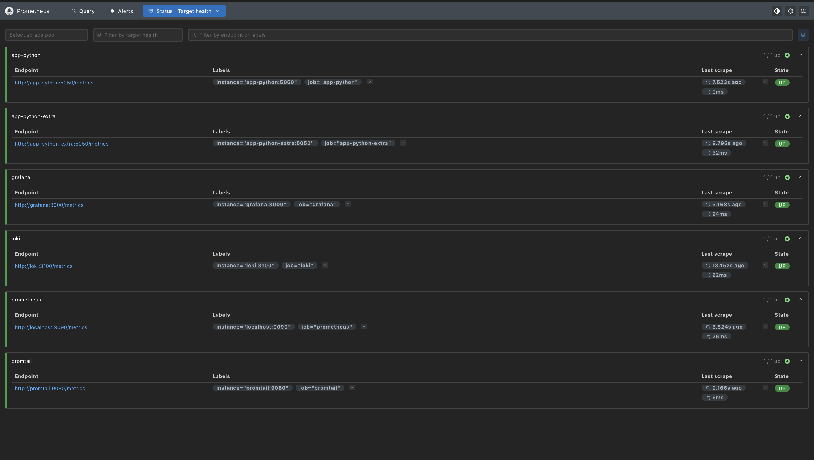
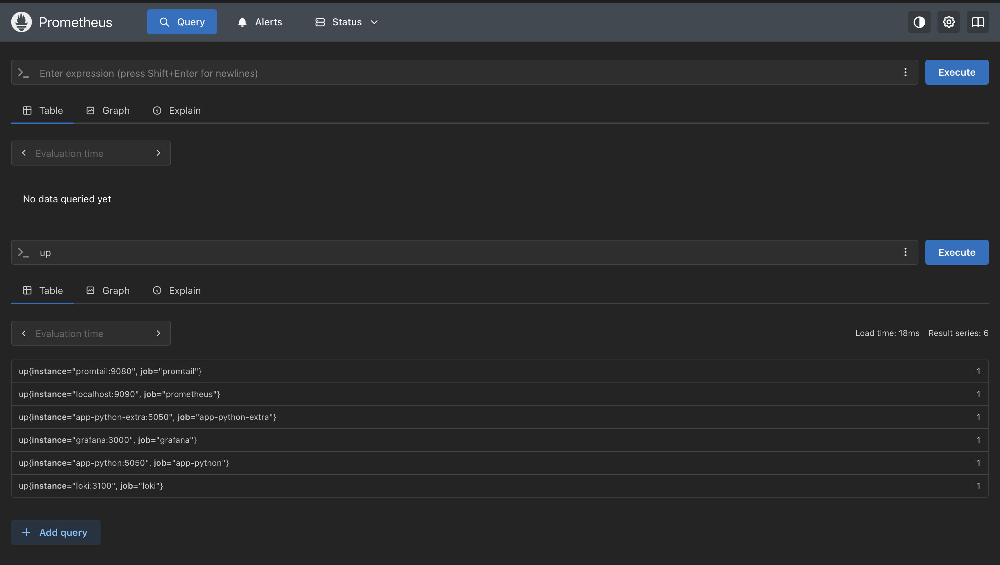
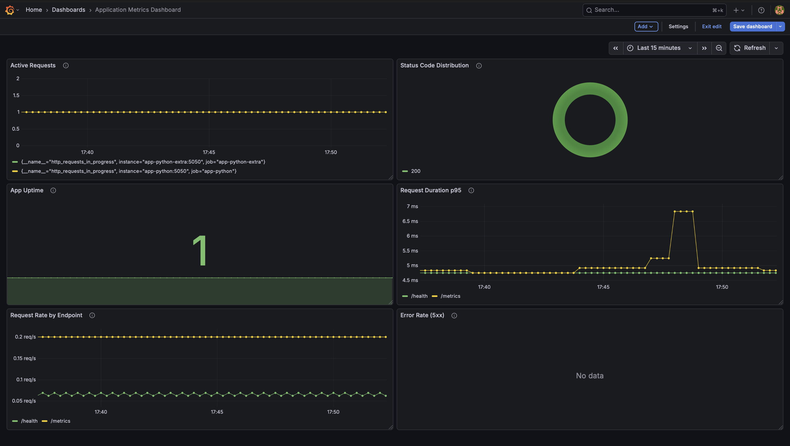

# Lab 8 — Metrics & Monitoring with Prometheus


## Architecture

┌─────────────────────────────────────────────────────────────────────────────┐
│                            MONITORING STACK                                 │
├─────────────────────────────────────────────────────────────────────────────┤
│                                                                             │
│                           Metrics and Logs                                  │
│                                                                             │
│    ┌──────────────┐      ┌──────────────┐      ┌──────────────┐             │
│    │    App       │      │    Prom      │      │    Grafana   │             │
│    │   Python     │ ────▶│   Prometheus │ ────▶│              │             │
│    │   :5050      │      │   :9090      │      │   :3000      │             │
│    └──────────────┘      └──────┬───────┘      └──────────────┘             │
│                                  │                                          │
│    ┌──────────────┐              │              ┌──────────────┐            │
│    │    App       │ ─────────────┘              │    Grafana   │            │
│    │   Python     │                             │              │            │
│    │ Extra:5050   │                             │              │            │
│    └──────────────┘                             └──────────────┘            │
│                                                                             │
│                           Logging                                           │
│                                                                             │
│    ┌──────────────┐      ┌──────────────┐      ┌──────────────┐             │
│    │    Loki      │ ◀────│   Promtail   │      │    Grafana   │             │
│    │   :3100      │      │   :9080      │      │              │             │
│    └──────────────┘      └──────────────┘      └──────────────┘             │
│                                                                             │
│                           Persistent volumes                                │
│    ┌─────────────────┐  ┌─────────────────┐  ┌─────────────────┐            │
│    │   prometheus-   │  │     loki-       │  │   grafana-      │            │
│    │     data        │  │     data        │  │     data        │            │
│    └─────────────────┘  └─────────────────┘  └─────────────────┘            │
│                                                                             │
└─────────────────────────────────────────────────────────────────────────────┘

### Data Flow
- **Python applications** expose metrics at `/metrics` endpoint
- **Prometheus** scrapes metrics every 15s from all targets
- **Prometheus** stores time-series data with 15-day retention
- **Grafana** queries Prometheus and visualizes metrics in dashboards
- **Loki stack** collects logs in parallel


## Application Instrumentation

| Metric | Type | Labels | Purpose |
|--------|------|--------|---------|
| `http_requests_total` | Counter | `method`, `endpoint`, `status` | Total HTTP requests count |
| `http_request_duration_seconds` | Histogram | `method`, `endpoint` | HTTP request duration distribution |
| `http_requests_in_progress` | Gauge | - | Current number of in-flight requests |
| `devops_info_endpoint_calls_total` | Counter | `endpoint` | Number of calls to devops info endpoint |
| `devops_info_system_collection_seconds` | Histogram | - | Time spent collecting system info |
| `process_memory_bytes` | Gauge | - | Process memory usage in bytes |


## Prometheus Configuration

### Retention:

- **Time-based**: 15 days
- **Size-based**: 10GB
- Configured via command line flags


## Dashboard Walkthrough

## Grafana Dashboard Panels

| Panel | Query | Visualization | Purpose |
|-------|-------|---------------|---------|
| Request Rate | `sum(rate(http_requests_total[5m])) by (endpoint)` | Time series | Shows traffic per endpoint |
| Error Rate | `sum(rate(http_requests_total{status=~"5.."}[5m]))` | Time series | Tracks 5xx errors |
| p95 Latency | `histogram_quantile(0.95, sum(rate(http_request_duration_seconds_bucket[5m])) by (le, endpoint))` | Time series | SLA monitoring |
| Active Requests | `http_requests_in_progress` | Time series | Concurrent load |
| Status Distribution | `sum(rate(http_requests_total[5m])) by (status)` | Pie chart | 2xx vs 4xx vs 5xx |
| Uptime | `up{job="app-python"}` | Stat | Service health |


## PromQL Examples

| Query | Explanation |
|-------|-------------|
| `up` | Shows all targets and their status (1=UP, 0=DOWN) |
| `rate(http_requests_total[5m])` | Requests per second over last 5 minutes |
| `sum by (status) (rate(http_requests_total[5m]))` | Request rate grouped by HTTP status |
| `histogram_quantile(0.95, rate(http_request_duration_seconds_bucket[5m]))` | 95th percentile latency |
| `topk(3, sum by (endpoint) (rate(http_requests_total[5m])))` | Top 3 busiest endpoints |
| `http_requests_in_progress` | Currently active requests |
| `rate(http_requests_total{status=~"5.."}[5m])` | Error rate (5xx) |
| `process_memory_bytes / 1024 / 1024` | Memory usage in MB |


## Production Setup

| Service | CPU Limit | Memory Limit | Health Check | Retention |
|---------|-----------|--------------|--------------|-----------|
| Prometheus | 1.0 | 1G | `/-/healthy` | 15d / 10GB |
| Loki | 1.0 | 1G | `/ready` | 7d |
| Grafana | 0.5 | 512M | `/api/health` | Persistent |
| Promtail | 0.5 | 512M | `/ready` | - |
| Python Apps | 0.3 | 256M | `/health` | - |


## Application Metrics

### `/metrics` endpoint output

```bash
http://localhost:5050/metrics
```

```bash
# HELP python_gc_objects_collected_total Objects collected during gc
# TYPE python_gc_objects_collected_total counter
python_gc_objects_collected_total{generation="0"} 0.0
python_gc_objects_collected_total{generation="1"} 220.0
python_gc_objects_collected_total{generation="2"} 0.0
# HELP python_gc_objects_uncollectable_total Uncollectable objects found during GC
# TYPE python_gc_objects_uncollectable_total counter
python_gc_objects_uncollectable_total{generation="0"} 0.0
python_gc_objects_uncollectable_total{generation="1"} 0.0
python_gc_objects_uncollectable_total{generation="2"} 0.0
# HELP python_gc_collections_total Number of times this generation was collected
# TYPE python_gc_collections_total counter
python_gc_collections_total{generation="0"} 0.0
python_gc_collections_total{generation="1"} 5.0
python_gc_collections_total{generation="2"} 0.0
# HELP python_info Python platform information
# TYPE python_info gauge
python_info{implementation="CPython",major="3",minor="14",patchlevel="2",version="3.14.2"} 1.0
# HELP http_requests_total Total HTTP requests
# TYPE http_requests_total counter
# HELP http_request_duration_seconds HTTP request duration in seconds
# TYPE http_request_duration_seconds histogram
# HELP http_requests_in_progress Number of HTTP requests currently being processed
# TYPE http_requests_in_progress gauge
http_requests_in_progress 1.0
# HELP devops_info_endpoint_calls_total Number of calls to each endpoint
# TYPE devops_info_endpoint_calls_total counter
devops_info_endpoint_calls_total{endpoint="/metrics"} 1.0
# HELP devops_info_endpoint_calls_created Number of calls to each endpoint
# TYPE devops_info_endpoint_calls_created gauge
devops_info_endpoint_calls_created{endpoint="/metrics"} 1.771246422591667e+09
# HELP devops_info_system_collection_seconds Time taken to collect system information
# TYPE devops_info_system_collection_seconds histogram
devops_info_system_collection_seconds_bucket{le="0.001"} 0.0
devops_info_system_collection_seconds_bucket{le="0.005"} 0.0
devops_info_system_collection_seconds_bucket{le="0.01"} 0.0
devops_info_system_collection_seconds_bucket{le="0.025"} 0.0
devops_info_system_collection_seconds_bucket{le="0.05"} 0.0
devops_info_system_collection_seconds_bucket{le="0.1"} 0.0
devops_info_system_collection_seconds_bucket{le="+Inf"} 0.0
devops_info_system_collection_seconds_count 0.0
devops_info_system_collection_seconds_sum 0.0
# HELP devops_info_system_collection_seconds_created Time taken to collect system information
# TYPE devops_info_system_collection_seconds_created gauge
devops_info_system_collection_seconds_created 1.771246414566783e+09
# HELP process_memory_bytes Memory usage of the Python process in bytes
# TYPE process_memory_bytes gauge
process_memory_bytes 4.2795008e+07
```

### Metric choices

**The RED Method**:

- **Rate** - Requests per second: `rate(http_requests_total[1m])`
- **Errors** - Error rate: `rate(http_requests_total{status=~"5.."}[1m])`
- **Duration** - Response time: `histogram_quantile(0.95, rate(http_request_duration_seconds_bucket[5m]))`

**Reason**:
- The Cover RED method is the basis for monitoring web services
- Minimal cardinality - labels won't blow up Prometheus
- Production-ready - something that is actually used in the industry


## Prometheus Setup

### All targets UP



### PromQL query




## Grafana Dashboards

### Custom application dashboard with live data




## Production Configuration

### `docker compose ps`

```bash
NAME               IMAGE                        COMMAND                  SERVICE            CREATED          STATUS                      PORTS
app-python         info-service-python:latest   "python app.py"          app-python         16 minutes ago   Up 16 minutes (healthy)     0.0.0.0:8000->5050/tcp
app-python-extra   info-service-python:latest   "python app.py"          app-python-extra   16 minutes ago   Up 16 minutes (healthy)     0.0.0.0:8001->5050/tcp
grafana            grafana/grafana:12.3.1       "/run.sh"                grafana            16 minutes ago   Up 16 minutes (healthy)     0.0.0.0:3000->3000/tcp
loki               grafana/loki:3.0.0           "/usr/bin/loki -conf…"   loki               16 minutes ago   Up 16 minutes (healthy)     0.0.0.0:3100->3100/tcp
prometheus         prom/prometheus:v3.9.0       "/bin/prometheus --c…"   prometheus         16 minutes ago   Up 16 minutes (healthy)     0.0.0.0:9090->9090/tcp
promtail           grafana/promtail:3.0.0       "/usr/bin/promtail -…"   promtail           16 minutes ago   Up 16 minutes (healthy)   0.0.0.0:9080->9080/tcp
```

### Retention policies

**Prometheus**:
- Time-based retention: 15 days
- Size-based retention: 10GB
- Configured via command line flags:
  - `--storage.tsdb.retention.time=15d`
  - `--storage.tsdb.retention.size=10GB`

**Loki**:
- Time-based retention: 7 days (168 hours)
- Configured in `loki/config.yml`:
  ```yaml
  limits_config:
    retention_period: 168h
  ```


## Ansible playbook execution

```bash
ansible-playbook -i inventory/hosts.ini playbooks/deploy-monitoring.yml
```

```bash
PLAY [Deploy Complete Observability Stack] *****************************************************************************************************************************

TASK [Gathering Facts] ******************************************************************************************************************************************
ok: [info-service]

TASK [Display deployment info] **********************************************************************************************************************************
ok: [info-service] => {
    "msg": "========================================\nDeploying Monitoring Stack\nLoki: 3.0.0\nGrafana: 12.3.1\nRetention: 168h\n========================================\n"
}

TASK [docker : Include cleanup tasks] ***************************************************************************************************************************
included: /Users/scruffyscarf/DevOps-Core-Course/ansible/roles/docker/tasks/cleanup.yml for info-service

TASK [docker : Remove all Docker repository files] **************************************************************************************************************
ok: [info-service] => (item=/etc/apt/sources.list.d/docker.list)
ok: [info-service] => (item=/etc/apt/sources.list.d/additional-repositories.list)
ok: [info-service] => (item=/etc/apt/keyrings/docker.gpg)
ok: [info-service] => (item=/etc/apt/keyrings/docker.asc)
ok: [info-service] => (item=/usr/share/keyrings/docker.gpg)
ok: [info-service] => (item=/etc/apt/trusted.gpg.d/docker.gpg)
ok: [info-service] => (item=/etc/apt/trusted.gpg.d/docker-archive-keyring.gpg)
ok: [info-service] => (item=/etc/apt/trusted.gpg.d/docker-ce.gpg)

TASK [docker : Remove any Docker repository from sources.list] **************************************************************************************************
ok: [info-service]

TASK [docker : Remove any Docker repository from sources.list.d] ************************************************************************************************
ok: [info-service]

TASK [docker : Clean apt cache] *********************************************************************************************************************************
ok: [info-service]

TASK [docker : Update apt cache] ********************************************************************************************************************************
changed: [info-service]

TASK [docker : Create keyrings directory] ***********************************************************************************************************************
ok: [info-service]

TASK [docker : Install Docker prerequisites] ********************************************************************************************************************
ok: [info-service]

TASK [docker : Add Docker GPG key] ******************************************************************************************************************************
ok: [info-service]

TASK [docker : Add Docker repository] ***************************************************************************************************************************
ok: [info-service]

TASK [docker : Update apt cache after repository setup] *********************************************************************************************************
changed: [info-service]

TASK [docker : Install Docker packages] *************************************************************************************************************************
ok: [info-service]

TASK [docker : Ensure pip is up to date] ************************************************************************************************************************
ok: [info-service]

TASK [docker : Install Docker Python SDK] ***********************************************************************************************************************
ok: [info-service]

TASK [docker : Start and enable Docker service] *****************************************************************************************************************
ok: [info-service]

TASK [docker : Wait for Docker to be ready] *********************************************************************************************************************
ok: [info-service]

TASK [docker : Add users to docker group] ***********************************************************************************************************************
ok: [info-service] => (item=ubuntu)
ok: [info-service] => (item=appuser)

TASK [docker : Create docker-compose directory] *****************************************************************************************************************
ok: [info-service]

TASK [docker : Verify Docker installation] **********************************************************************************************************************
ok: [info-service]

TASK [docker : Display Docker version] **************************************************************************************************************************
ok: [info-service] => {
    "msg": "Docker version: Docker version 29.2.1, build a5c7197"
}

TASK [common : Update apt cache] ********************************************************************************************************************************
ok: [info-service]

TASK [common : Install common packages] *************************************************************************************************************************
ok: [info-service]

TASK [common : Upgrade system packages] *************************************************************************************************************************
skipping: [info-service]

TASK [common : Log package installation completion] *************************************************************************************************************
ok: [info-service] => {
    "msg": "Package installation block completed"
}

TASK [common : Create completion timestamp] *********************************************************************************************************************
changed: [info-service]

TASK [common : Create application user] *************************************************************************************************************************
ok: [info-service]

TASK [common : Ensure SSH directory exists for app user] ********************************************************************************************************
ok: [info-service]

TASK [common : Add users to sudo group] *************************************************************************************************************************
skipping: [info-service]

TASK [common : User management completed] ***********************************************************************************************************************
ok: [info-service] => {
    "msg": "User management block finished"
}

TASK [common : Set timezone] ************************************************************************************************************************************
ok: [info-service]

TASK [common : Configure hostname] ******************************************************************************************************************************
ok: [info-service]

TASK [common : Configure SSH hardening] *************************************************************************************************************************
ok: [info-service] => (item={'key': 'PasswordAuthentication', 'value': 'no'})
ok: [info-service] => (item={'key': 'PermitRootLogin', 'value': 'no'})
ok: [info-service] => (item={'key': 'ClientAliveInterval', 'value': '300'})

TASK [monitoring : Include setup tasks] *************************************************************************************************************************
included: /Users/scruffyscarf/DevOps-Core-Course/ansible/roles/monitoring/tasks/setup.yml for info-service

TASK [monitoring : Create monitoring directories] ***************************************************************************************************************
ok: [info-service] => (item=/opt/monitoring)
ok: [info-service] => (item=/opt/monitoring/loki)
ok: [info-service] => (item=/opt/monitoring/promtail)
ok: [info-service] => (item=/var/lib/monitoring)

TASK [monitoring : Remove Loki config if it is a directory] *****************************************************************************************************
changed: [info-service]

TASK [monitoring : Template Loki configuration] *****************************************************************************************************************
changed: [info-service]

TASK [monitoring : Template Promtail configuration] *************************************************************************************************************
ok: [info-service]

TASK [monitoring : Template Docker Compose file] ****************************************************************************************************************
ok: [info-service]

TASK [monitoring : Login to Docker Hub] *************************************************************************************************************************
skipping: [info-service]

TASK [monitoring : Include deploy tasks] ************************************************************************************************************************
included: /Users/scruffyscarf/DevOps-Core-Course/ansible/roles/monitoring/tasks/deploy.yml for info-service

TASK [monitoring : Deploy monitoring stack with Docker Compose] *************************************************************************************************
ok: [info-service]

TASK [monitoring : Display compose result] **********************************************************************************************************************
ok: [info-service] => {
    "msg": "Stack deployed: []"
}

TASK [monitoring : Wait for Loki to be ready] *******************************************************************************************************************
ok: [info-service]

TASK [monitoring : Wait for Promtail to be ready] ***************************************************************************************************************
ok: [info-service]

TASK [monitoring : Wait for Grafana to be ready] ****************************************************************************************************************
ok: [info-service]

TASK [monitoring : Wait for Prometheus to be ready] ************************************************************************************************************
changed: [info-service]

TASK [monitoring : Wait for Python apps to be ready] ************************************************************************************************************
ok: [info-service]

PLAY RECAP ******************************************************************************************************************************************************
info-service               : ok=46   changed=6    unreachable=0    failed=0    skipped=3    rescued=0    ignored=0  
```bash

```


## Idempotency

```bash
ansible-playbook -i inventory/hosts.ini playbooks/deploy-monitoring.yml
```

```bash
PLAY [Deploy Complete Observability Stack] *****************************************************************************************************************************

TASK [Gathering Facts] ******************************************************************************************************************************************
ok: [info-service]

TASK [Display deployment info] **********************************************************************************************************************************
ok: [info-service] => {
    "msg": "========================================\nDeploying Monitoring Stack\nLoki: 3.0.0\nGrafana: 12.3.1\nRetention: 168h\n========================================\n"
}

TASK [docker : Include cleanup tasks] ***************************************************************************************************************************
included: /Users/scruffyscarf/DevOps-Core-Course/ansible/roles/docker/tasks/cleanup.yml for info-service

TASK [docker : Remove all Docker repository files] **************************************************************************************************************
ok: [info-service] => (item=/etc/apt/sources.list.d/docker.list)
ok: [info-service] => (item=/etc/apt/sources.list.d/additional-repositories.list)
ok: [info-service] => (item=/etc/apt/keyrings/docker.gpg)
ok: [info-service] => (item=/etc/apt/keyrings/docker.asc)
ok: [info-service] => (item=/usr/share/keyrings/docker.gpg)
ok: [info-service] => (item=/etc/apt/trusted.gpg.d/docker.gpg)
ok: [info-service] => (item=/etc/apt/trusted.gpg.d/docker-archive-keyring.gpg)
ok: [info-service] => (item=/etc/apt/trusted.gpg.d/docker-ce.gpg)

TASK [docker : Remove any Docker repository from sources.list] **************************************************************************************************
ok: [info-service]

TASK [docker : Remove any Docker repository from sources.list.d] ************************************************************************************************
ok: [info-service]

TASK [docker : Clean apt cache] *********************************************************************************************************************************
ok: [info-service]

TASK [docker : Update apt cache] ********************************************************************************************************************************
changed: [info-service]

TASK [docker : Create keyrings directory] ***********************************************************************************************************************
ok: [info-service]

TASK [docker : Install Docker prerequisites] ********************************************************************************************************************
ok: [info-service]

TASK [docker : Add Docker GPG key] ******************************************************************************************************************************
ok: [info-service]

TASK [docker : Add Docker repository] ***************************************************************************************************************************
ok: [info-service]

TASK [docker : Update apt cache after repository setup] *********************************************************************************************************
changed: [info-service]

TASK [docker : Install Docker packages] *************************************************************************************************************************
ok: [info-service]

TASK [docker : Ensure pip is up to date] ************************************************************************************************************************
ok: [info-service]

TASK [docker : Install Docker Python SDK] ***********************************************************************************************************************
ok: [info-service]

TASK [docker : Start and enable Docker service] *****************************************************************************************************************
ok: [info-service]

TASK [docker : Wait for Docker to be ready] *********************************************************************************************************************
ok: [info-service]

TASK [docker : Add users to docker group] ***********************************************************************************************************************
ok: [info-service] => (item=ubuntu)
ok: [info-service] => (item=appuser)

TASK [docker : Create docker-compose directory] *****************************************************************************************************************
ok: [info-service]

TASK [docker : Verify Docker installation] **********************************************************************************************************************
ok: [info-service]

TASK [docker : Display Docker version] **************************************************************************************************************************
ok: [info-service] => {
    "msg": "Docker version: Docker version 29.2.1, build a5c7197"
}

TASK [common : Update apt cache] ********************************************************************************************************************************
ok: [info-service]

TASK [common : Install common packages] *************************************************************************************************************************
ok: [info-service]

TASK [common : Upgrade system packages] *************************************************************************************************************************
skipping: [info-service]

TASK [common : Log package installation completion] *************************************************************************************************************
ok: [info-service] => {
    "msg": "Package installation block completed"
}

TASK [common : Create completion timestamp] *********************************************************************************************************************
changed: [info-service]

TASK [common : Create application user] *************************************************************************************************************************
ok: [info-service]

TASK [common : Ensure SSH directory exists for app user] ********************************************************************************************************
ok: [info-service]

TASK [common : Add users to sudo group] *************************************************************************************************************************
skipping: [info-service]

TASK [common : User management completed] ***********************************************************************************************************************
ok: [info-service] => {
    "msg": "User management block finished"
}

TASK [common : Set timezone] ************************************************************************************************************************************
ok: [info-service]

TASK [common : Configure hostname] ******************************************************************************************************************************
ok: [info-service]

TASK [common : Configure SSH hardening] *************************************************************************************************************************
ok: [info-service] => (item={'key': 'PasswordAuthentication', 'value': 'no'})
ok: [info-service] => (item={'key': 'PermitRootLogin', 'value': 'no'})
ok: [info-service] => (item={'key': 'ClientAliveInterval', 'value': '300'})

TASK [monitoring : Include setup tasks] *************************************************************************************************************************
included: /Users/scruffyscarf/DevOps-Core-Course/ansible/roles/monitoring/tasks/setup.yml for info-service

TASK [monitoring : Create monitoring directories] ***************************************************************************************************************
ok: [info-service] => (item=/opt/monitoring)
ok: [info-service] => (item=/opt/monitoring/loki)
ok: [info-service] => (item=/opt/monitoring/promtail)
ok: [info-service] => (item=/var/lib/monitoring)

TASK [monitoring : Remove Loki config if it is a directory] *****************************************************************************************************
changed: [info-service]

TASK [monitoring : Template Loki configuration] *****************************************************************************************************************
changed: [info-service]

TASK [monitoring : Template Promtail configuration] *************************************************************************************************************
ok: [info-service]

TASK [monitoring : Template Docker Compose file] ****************************************************************************************************************
ok: [info-service]

TASK [monitoring : Login to Docker Hub] *************************************************************************************************************************
skipping: [info-service]

TASK [monitoring : Include deploy tasks] ************************************************************************************************************************
included: /Users/scruffyscarf/DevOps-Core-Course/ansible/roles/monitoring/tasks/deploy.yml for info-service

TASK [monitoring : Deploy monitoring stack with Docker Compose] *************************************************************************************************
ok: [info-service]

TASK [monitoring : Display compose result] **********************************************************************************************************************
ok: [info-service] => {
    "msg": "Stack deployed: []"
}

TASK [monitoring : Wait for Loki to be ready] *******************************************************************************************************************
ok: [info-service]

TASK [monitoring : Wait for Promtail to be ready] ***************************************************************************************************************
ok: [info-service]

TASK [monitoring : Wait for Grafana to be ready] ****************************************************************************************************************
ok: [info-service]

TASK [monitoring : Wait for Prometheus to be ready] ************************************************************************************************************
ok: [info-service]

TASK [monitoring : Wait for Python apps to be ready] ************************************************************************************************************
ok: [info-service]

PLAY RECAP ******************************************************************************************************************************************************
info-service               : ok=46   changed=5    unreachable=0    failed=0    skipped=3    rescued=0    ignored=0  